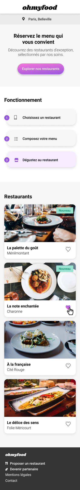

# Ohmyfood - Mobile
OpenclassRooms JavascScript React project 3 - "Ohmyfood"

**Instruction:** Create mobile friendly website with
* Fake loader on home page
* Stagered animation for menu on restaurants pages
* Cool hover effect on button and cards
* 1 home page and 4 restaurants pages
* Versioning on GitHub
* Upload website on GitHub Pages

### To compile SCSS use this command in `/styles` directory

```Terminal
sass main.scss:style.css --watch
```

Result : 👉 [Here](https://fabkaiz.github.io/ohmyfood-mobile)

#### What i used :
* Html
* [scss](https://sass-lang.com/)


#### Screenshot

